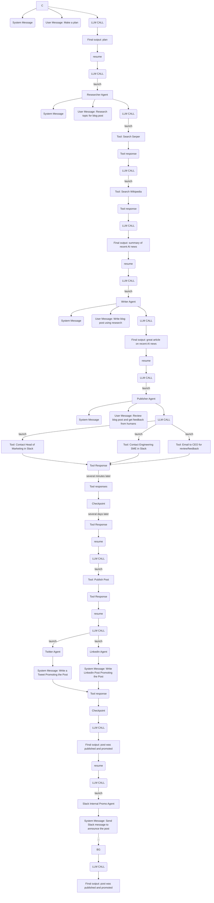

<div align="center">

<h1>Smallchain</h1>

</div>

Smallchain is a cloud-native orchestrator for Autonomous AI Agents. It supports long-lived outer-loop agents that can process asynchronous execution of both LLM inference and long-running tool calls. 


:warning: **Note** - SmallChain is highly experimental and has several known issues and race conditions. Use at your own risk.
 
<div align="center">

<h3>

[Deep Dive](./smallchain.md) | [Discord](https://discord.gg/AK6bWGFY7d) | [Documentation](./docs) | [Examples](./examples)

</h3>

[](https://github.com/humanlayer/smallchain)
[](https://opensource.org/licenses/Apache-2)

</div>

## Table of contents

- [Getting Started](#getting-started)
- [Why Smallchain?](#why-smallchain)
- [Objects](#objects)
- [Key Features](#key-features)
- [Examples](#examples)
- [Roadmap](#roadmap)
- [Contributing](#contributing)
- [License](#license)

## Getting Started

To get started, check out [Getting Started](./docs/getting-started.md), or jump straight into one of the [Examples](./examples/)

## Design Principles

- *Clarity* - it should be easy to understand what's happening, what the framework is doing with my prompts.
- *Control* - it should be possible to do anything w/ SmallChain that you can do taking the reins yourself. SmallChain MUST NOT recreate the common "i can't use this because I can't customize XYZ prompt scenario" problem.
- *Modularity* - SmallChain is composed of small control loops with a limited scope that each progress the state of the world.
- *Durability* - SmallChain is a distributed system and should be resilient to faliures.
- *Simplicity* - AI applications built on a chat completions API have the UNPRECEDENTEND benefit that the entire state of a workflow, the entire "call stack", can be expressed as the rolling context window accumulated through interactions and tool calls. Leverage this to cut corners

Stretch goals / future

- *Extensible* - it should be easy to build and share agents, tools, and tasks
- *Hackable* - it should be straightforward to unhook from the chat completions API and do whatever folks want WRT prompt / special tokens / context management 

## Objects

LLM = provider + keys + params

AGENT = LLM + System Prompt + TOOL[]

TOOL = local fn OR api OR docker OR agent

TASK = AGENT + User Message

TASK RUN = TASK + current context window

## Example

<details>
<summary>Coming Soon</summary>

Create `smallchain.yaml`:

```yaml
llms:
  - name: "gpt-4o
    provider: openai
    model: gpt-4o
    parameters:
      temperature: 0.0

agents:
  - name: "assistant"
    system_prompt: "your goal is to assist the human with their tasks"
    llm: "gpt-4o"
    tools:
      - agent: "calculator_operator"
  - name: calculator_operator
    system_prompt: "you are a skilled calculator operator"
    tools:
      - add
      # - subtract
      # - multiply
      # - divide

tools:
  - name: add
    builtin: add

  - name: subtract
    description: "subtract two numbers"
    parameters:
      type: object
      properties:
        a:
          type: number
          description: "The first number"
        b:
          type: number
          description: "The second number"
    executor:
      python: # or docker, local_nodejs, local_bash, etc.
        image: "python:3.12"
        command: |
          python -c "print(a - b)"
        requirements: []
    
tasks:
  - name: "do_some_math"
    user_message: "add (3 + 4) and (5 + 3) and add the results"
    agent: assistant

runs:
  - name: "my first run"
    task: do_some_math
```


```shell
brew install humanlayer/smallchain/smallchain
```

```shell
smallchain apply -f smallchain.yaml
```

```shell
smallchain get events --pretty
```

```text
[2024-07-28 12:00:00] [INFO] Starting Smallchain
[2024-07-28 12:00:05] [INFO] Executing task: determine the current weather in tokyo
[2024-07-28 12:00:07] [INFO] Agent 'assistant' is executing the task
[2024-07-28 12:00:10] [INFO] Agent 'assistant' is using tool: get_current_weather
[2024-07-28 12:00:12] [INFO] Tool 'get_current_weather' executed successfully
[2024-07-28 12:00:13] [INFO] Agent 'assistant' has completed the task
[2024-07-28 12:00:14] [INFO] Task completed: determine the current weather in tokyo
[2024-07-28 12:00:15] [INFO] Output: The current temperature in Tokyo is 75°F (24°C)
[2024-07-28 12:00:16] [INFO] Run 'my first run' completed successfully
```

You can query the state of the workflow as the agent runs

```shell
smallchain get runs
```

```text
RUN                 NAME                STATUS    TASK ID             DEPTH
my first run        assistant           Running    do_some_math       0
```
</details>

<details>
<summary>Some draft-y mermaid docs</summary>





</details>


```mermaid
flowchart TD;
    MC[Manager Chain];
    style MC fill:#FFB0B5
    MC -->MCSM(System Message - list of agents to delegate to)
    style MCSM fill:#FFF
    MCSM --> MCUM(User Message: Create a Blog Post and promote it on linkedin, twitter, and slack)
    style MCUM fill:#FFF
    MCUM -->MCLLM(LLM CALL)
    MCLLM -->MCTC(Async Tool Call: Delegate to Planner Chain)
    style MCTC fill:#FFF
    subgraph Planner
      PCSM
      PCUM
      PCLLM
      PCFA
    end
    MCTC -->|launch| Planner;
    MCTC -->CP1[checkpoint]
    style CP1 fill:#88ffbb 
    PCSM(System Message)
    style PCSM fill:#FFF
    PCSM --> PCUM(User Message)
    style PCUM fill:#FFF
    PCUM --> PCLLM(LLM CALL)
    PCLLM --> PCFA(Final Answer: Plan)
    style PCFA fill:#FFF 
    MCTCR(Tool Call Response)
    PCFA -->|callback| MCTCR
    style MCTCR fill:#FFF
    R1[resume]
    style R1 fill:#88ffbb 
    MCTCR -->R1
    MCTC --> MCTCR
    CP1 --> R1
    MCLLM o--o CP1
    R1 --> MCLLM2[LLM CALL]
    MCLLM2 --> MCTC2[Async Tool Call: Delegate to Researcher Agent]
    style MCTC2 fill:#FFF
    subgraph Researcher
      RASM
      RUM
      RLLM
      RLLM2
      RLLM3
      RTC1
      RTC1X
      RTCR1
      RTC2
      RTC2X
      RTCR2
      RFA
    end
    MCTC2 -->|launch| Researcher;
    CP2[checkpoint]
    style CP2 fill:#88ffbb 
    MCTC2 --> CP2
    MCLLM2 o--o CP2
    RASM[System Message]
    style RASM fill:#FFF
    RASM --> RUM[User Message]
    style RUM fill:#FFF
    RUM --> RLLM[LLM CALL]
    RLLM --> RTC1[Sync Tool Call: Search Serper]
    style RTC1 fill:#FFF
    RTC1 --> RTCR1(Tool Call Response)
    RTC1 --> RTC1X(Serper API Call)
    RTC1X --> RTCR1
    style RTCR1 fill:#FFF
    RTCR1 --> RLLM2[LLM CALL]
    RLLM2 --> RTC2[Sync Tool Call: Search Wikipedia]
    style RTC2 fill:#FFF
    RTC2 --> RTCR2(Tool Call Response)
    RTC2 --> RTC2X(Wikipedia API Call)
    RTC2X --> RTCR2
    style RTCR2 fill:#FFF
    RTCR2 --> RLLM3[LLM CALL]
    RLLM3 --> RFA[Final Answer: Research]
    style RFA fill:#FFF
    MCTCR2(Tool Call Response)
    style MCTCR2 fill:#FFF
    RFA -->|callback| MCTCR2
    R2[resume]
    style R2 fill:#88ffbb 
    MCTCR2 --> R2
    MCTC2 --> MCTCR2
    CP2 --> R2
```

## Why SmallChain?

SmallChain is built to empower the next generation of AI agents - Autonomous Agents, but it's just a piece of the puzzle. To clarify "next generation", we can summarize briefly the history of LLM applications.

- **Gen 1**: Chat - human-initiated question / response interface
- **Gen 2**: Agentic Assistants - frameworks drive prompt routing, tool calling, chain of thought, and context window management to get much more reliability and functionality. Most workflows are initiated by humans in single-shot "here's a task, go do it" or rolling chat interfaces.
- **Gen 3**: Autonomous Agents - no longer human initiated, agents will live in the "outer loop" driving toward their goals using various tools and functions. Human/Agent communication is Agent-initiated rather than human-initiated.


### On Human Collaboration

Gen 3 autonomous agents will need ways to consult humans for input on various tasks. In order for these agents to perform actual useful work, they'll to do long-running things like communicate with humans and wait for a response. [HumanLayer](https://github.com/humanlayer/humanlayer) is a general-purpose framework for incorporating human feedback and approvals into agentic workflows.

## Key Features

- **Durable Agent Execution**: SmallChain implements something like async/await at the infrastructure layer, checkpointing a conversation chain whenever a tool call or agent delegation occurs, with the ability to resume from that checkpoint when the operation completes
- **Dynamic Workflow Planning**: Allow agents to reprioritize and replan their workflows mid-execution
- **Simple + Observable Control Loop Architecture**: SmallChain uses a simple, observable control loop architecture that allows for easy debugging and observability into agent execution.
- **Human Approvals and Input**: Support for durable task execution across long-running function calls means a simple tool-based interface to allow an agent to ask a human for input or wait for an approval
- **Self-Managing Agents**: Built in tools for agents to manage and budget their own spend and usage, like `check_current_spend_since()` and `sleep_until()`. Give agents an hourly or daily budget for work, and let them prioritize their own work or decide when to take a break. Or, configure hard limits on spend or time to prevent runaway agents.


## Roadmap

| Feature                                | Status              |
|----------------------------------------|---------------------|
| Local SQLite Runtime                   | 🚧 Alpha            |
| Tool Calling Support                   | 🚧 Work in progress |
| Configurable LLMs                      | 🚧 Work in progress |
| External Callbacks for Tool Calls      | 🗓️ Planned          |
| Kubernetes Runtime                     | 🗓️ Planned          |

## Contributing

SmallChain is open-source and we welcome contributions in the form of issues, documentation, pull requests, and more. See [CONTRIBUTING.md](./CONTRIBUTING.md) for more details.

[](https://star-history.com/#humanlayer/smallchain&Date)


## License

SmallChain is licensed under the Apache 2 License.
