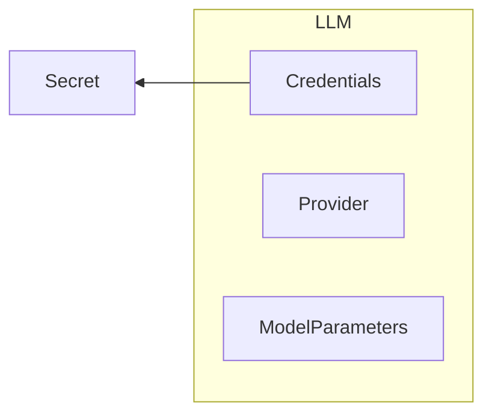
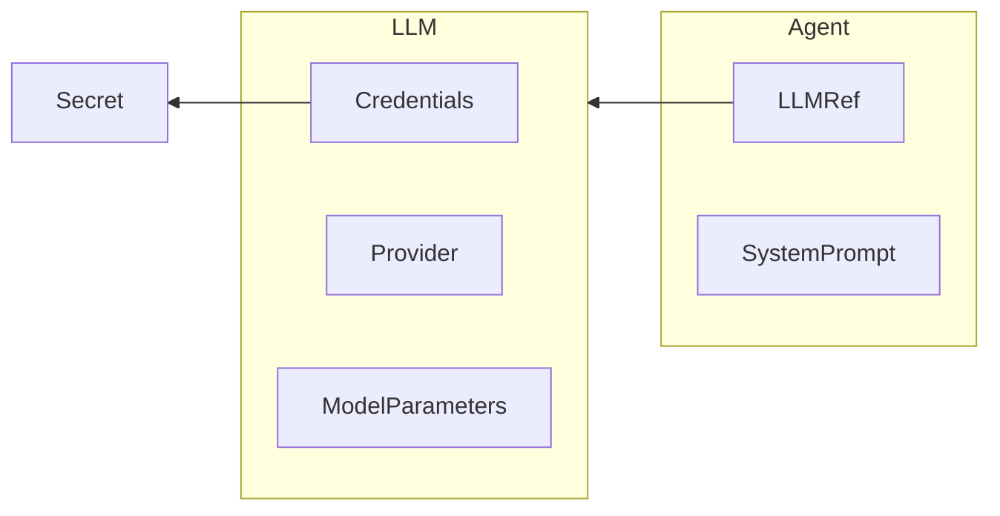
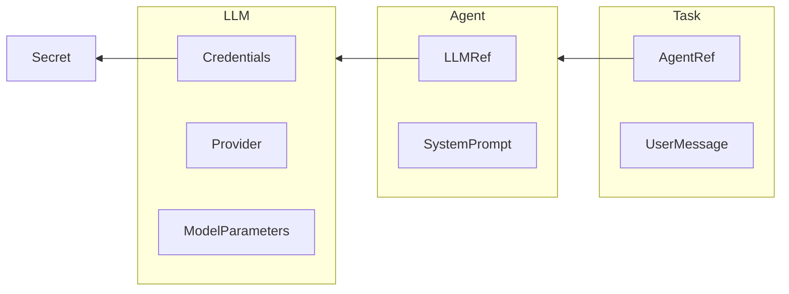
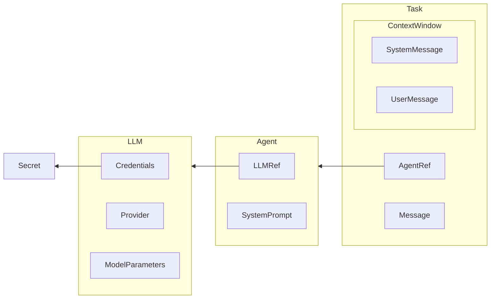
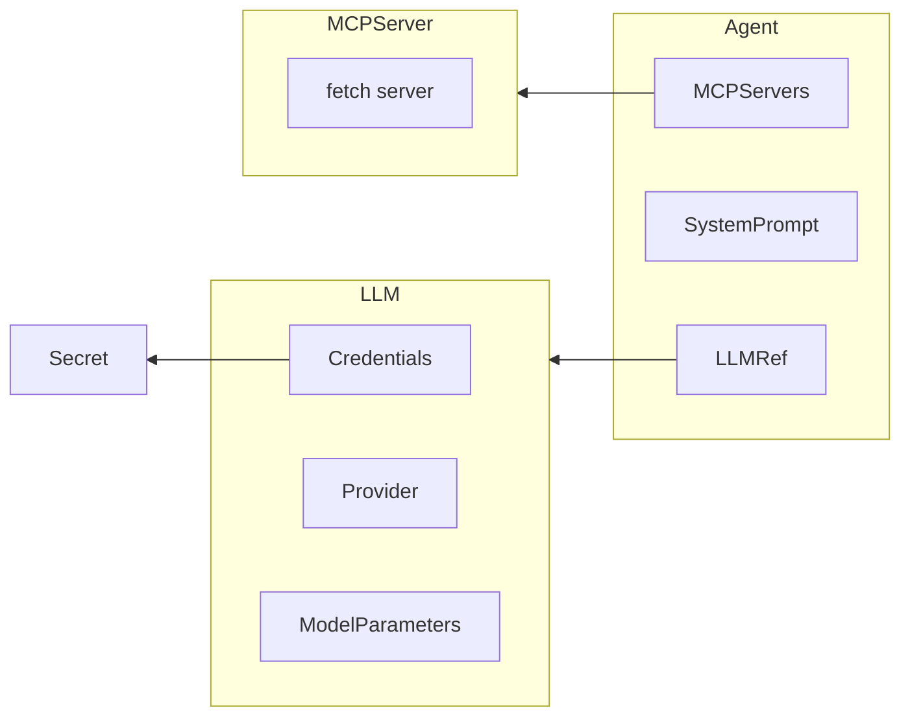
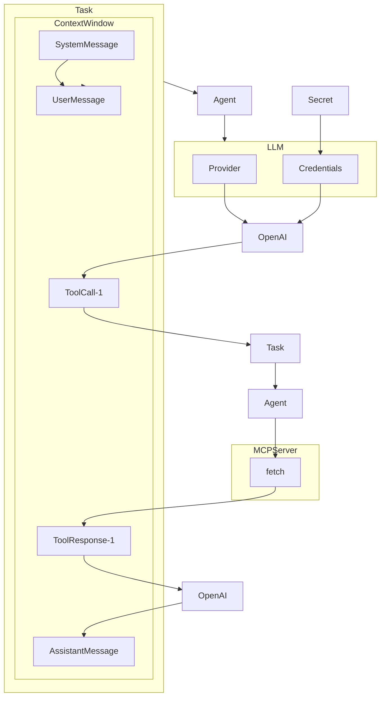

<div align="center">

<h1>KubeChain</h1>

</div>

KubeChain is a cloud-native orchestrator for AI Agents built on Kubernetes. It supports [long-lived outer-loop agents](https://theouterloop.substack.com/p/openais-realtime-api-is-a-step-towards) that can process asynchronous execution of both LLM inference and long-running tool calls. It's designed for simplicity and gives strong durability and reliability guarantees for agents that make asynchronous tool calls like contacting humans or delegating work to other agents.

:warning: **Note** - KubeChain is experimental and some known issues and race conditions. Use at your own risk.

<div align="center">

<h3>

[Discord](https://discord.gg/AK6bWGFY7d) | [Documentation](./kubechain/docs) | [Examples](./kubechain-example)

</h3>

[](https://github.com/humanlayer/kubechain)
[](https://opensource.org/licenses/Apache-2)

</div>

## Table of Contents

- [Key Features](#key-features)
- [Architecture](#architecture)
  - [Core Objects](#core-objects)
- [Getting Started](#getting-started)
  - [Prerequisites](#prerequisites)
  - [Setting Up a Local Cluster](#setting-up-a-local-cluster)
  - [Deploying KubeChain](#deploying-kubechain)
  - [Creating Your First Agent](#creating-your-first-agent)
  - [Running Your First Task](#running-your-first-task)
  - [Inspecting the Task more closely](#inspecting-the-task-more-closely)
  - [Adding Tools with MCP](#adding-tools-with-mcp)
  - [Cleaning Up](#cleaning-up)
- [Design Principles](#design-principles)
- [Contributing](#contributing)
- [License](#license)


## Architecture

### Core Objects

- **LLM**: Provider + API Keys + Parameters
- **Agent**: LLM + System Prompt + Tools
- **Tools**: MCP Servers, Humans, Other Agents
- **Task**: Agent + User Message + Current context window
<!-- todo rename to ToolCall -->
- **TaskRunToolCall**: A single tool call that occurred during a Task

## Getting Started

### Prerequisites

To run KubeChain, you'll need:

- **kubectl** - Command-line tool for Kubernetes `brew install kubectl`
- **OpenAI API Key** - For LLM functionality https://platform.openai.com

To run KubeChain locally on macos, you'll also need:

- **kind** - For running local Kubernetes clusters `brew install kind` (other cluster options should work too)
- **Docker** - For building and running container images `brew install --cask docker`

### Setting Up a Local Cluster

```bash
kind create cluster
```

### Add your OpenAI API key as a Kubernetes secret

```bash
kubectl create secret generic openai \
  --from-literal=OPENAI_API_KEY=$OPENAI_API_KEY \
  --namespace=default
```

### Deploying KubeChain


> [!TIP]
> For better visibility when running tutorial, we recommend starting
> a stream to watch all the events as they're happening,
> for example:
>
> ```bash
> kubectl get events --watch
> ```

Deploy the KubeChain operator to your cluster:

```bash
kubectl apply -f https://raw.githubusercontent.com/humanlayer/smallchain/refs/heads/main/kubechain/config/release/latest.yaml
```

<details>
<summary>Just the CRDs</summary>

```bash
kubectl apply -f https://raw.githubusercontent.com/humanlayer/smallchain/refs/heads/main/kubechain/config/release/latest-crds.yaml
```

</details>

<details>
<summary>Install a specific version</summary>

```bash
kubectl apply -f https://raw.githubusercontent.com/humanlayer/smallchain/refs/heads/main/kubechain/config/release/v0.1.0.yaml
```

</details>

This command will build the operator, create necessary CRDs, and deploy the KubeChain components to your cluster.

### Creating Your First Agent

1. **Define an LLM resource**

```bash
cat <<EOF | kubectl apply -f -
apiVersion: kubechain.humanlayer.dev/v1alpha1
kind: LLM
metadata:
  name: gpt-4o
spec:
  provider: openai
  apiKeyFrom:
    secretKeyRef:
      name: openai
      key: OPENAI_API_KEY
EOF
```



Check the created LLM:

```bash
kubectl get llm
```

   Output:
```
NAME     PROVIDER   READY   STATUS
gpt-4o   openai     true    Ready
```

<details>
<summary>Using `-o wide` and `describe`</summary>

```bash
kubectl get llm -o wide
```

   Output:
```
NAME     PROVIDER   READY   STATUS   DETAIL
gpt-4o   openai     true    Ready    OpenAI API key validated successfully
```

```bash
kubectl describe llm
```

Output:

```
Name:         gpt-4o
Namespace:    default
Labels:       <none>
Annotations:  <none>
API Version:  kubechain.humanlayer.dev/v1alpha1
Kind:         LLM
Metadata:
  Creation Timestamp:  2025-03-21T20:18:17Z
  Generation:          2
  Resource Version:    1682222
  UID:                 973098fb-2b8d-46b3-be49-81592e0b8f4e
Spec:
  API Key From:
    Secret Key Ref:
      Key:   OPENAI_API_KEY
      Name:  openai
  Provider:  openai
Status:
  Ready:          true
  Status:         Ready
  Status Detail:  OpenAI API key validated successfully
Events:
  Type    Reason               Age                 From            Message
  ----    ------               ----                ----            -------
  Normal  ValidationSucceeded  32m (x3 over 136m)  llm-controller  OpenAI API key validated successfully
```

</details>

2. **Create an Agent resource**

```bash
cat <<EOF | kubectl apply -f -
apiVersion: kubechain.humanlayer.dev/v1alpha1
kind: Agent
metadata:
  name: my-assistant
spec:
  llmRef:
    name: gpt-4o
  system: |
    You are a helpful assistant. Your job is to help the user with their tasks.
EOF
```



   Check the created Agent:

```bash
kubectl get agent
```

   Output:
```
NAME           READY   STATUS
my-assistant   true    Ready
```

<details>
<summary>Using `-o wide` and `describe`</summary>

```bash
kubectl get agent -o wide
```

   Output:
```
NAME           READY   STATUS   DETAIL
my-assistant   true    Ready    All dependencies validated successfully
```

```bash
kubectl describe agent
```

Output:

```
Name:         my-assistant
Namespace:    default
Labels:       <none>
Annotations:  <none>
API Version:  kubechain.humanlayer.dev/v1alpha1
Kind:         Agent
Metadata:
  Creation Timestamp:  2025-03-21T22:06:27Z
  Generation:          1
  Resource Version:    1682754
  UID:                 e389b3e5-c718-4abd-aa72-d4fc82c9b992
Spec:
  Llm Ref:
    Name:  gpt-4o
  System:  You are a helpful assistant. Your job is to help the user with their tasks.

Status:
  Ready:          true
  Status:         Ready
  Status Detail:  All dependencies validated successfully
Events:
  Type    Reason               Age                From              Message
  ----    ------               ----               ----              -------
  Normal  Initializing         64m                agent-controller  Starting validation
  Normal  ValidationSucceeded  64m (x2 over 64m)  agent-controller  All dependencies validated successfully
```

</details>### Running Your First TaskRun
Create a TaskRun to interact with your agent:


```bash
cat <<EOF | kubectl apply -f -
apiVersion: kubechain.humanlayer.dev/v1alpha1
kind: Task
metadata:
  name: hello-world-1
spec:
  agentRef:
    name: my-assistant
  userMessage: "What is the capital of the moon?"
EOF
```


Check the created Task:

```bash
kubectl get task
```

   Output:

```
NAME            READY   STATUS   PHASE         PREVIEW   OUTPUT
hello-world-1   true    Ready    FinalAnswer             The Moon does not have a capital, as it is not a governed entity like a country. It is a natural satellite of Earth. However, if you are referring to human activity on the Moon, there is no permanent settlement or colony established there as of now. Most activities on the Moon have been in the form of missions or landings conducted by various space agencies.
```

You can describe the task to see the full context window

```bash
kubectl describe task
```

Output:

```
# ...snip...
Status:
  Context Window:
    Content:  You are a helpful assistant. Your job is to help the user with their tasks.

    Role:     system
    Content:  What is the capital of the moon?
    Role:     user
    Content:  The Moon does not have a capital, as it is not a governed entity like a country. It is a natural satellite of Earth. However, if you are referring to human activity on the Moon, there is no permanent settlement or colony established there as of now. Most activities on the Moon have been in the form of missions or landings conducted by various space agencies.
    Role:     assistant

# ...snip...

  Status Detail:  LLM final response received
Events:
  Type    Reason                     Age   From             Message
  ----    ------                     ----  ----             -------
  Normal  ValidationSucceeded        65s   task-controller  Task validation succeeded
  Normal  SendingContextWindowToLLM  65s   task-controller  Sending context window to LLM
  Normal  LLMFinalAnswer             64s   task-controller  LLM response received successfully

```

</details>

The Task object stores and manages the context window of a agent conversation loop.



To get just the output, run

```
kubectl get taskrun -o jsonpath='{.items[*].status.output}'
```

and you'll see


> The Moon does not have a capital. It is a natural satellite of Earth and lacks any governmental structure or human habitation that would necessitate a capital city.

you can also describe the task to see the full context window in a slightly more readable format (but without the events)

```bash
kubectl get task -o yaml
```

<details>
<summary>Output (truncated for brevity)</summary>

```
apiVersion: v1
items:
- apiVersion: kubechain.humanlayer.dev/v1alpha1
  kind: Task
  metadata:
    annotations:
      kubectl.kubernetes.io/last-applied-configuration: |
        {"apiVersion":"kubechain.humanlayer.dev/v1alpha1","kind":"Task","metadata":{"annotations":{},"name":"hello-world-1","namespace":"default"},"spec":{"agentRef":{"name":"my-assistant"},"userMessage":"What is the capital of the moon?"}}
    creationTimestamp: "2025-04-05T01:04:15Z"
    generation: 1
    name: hello-world-1
    namespace: default
    resourceVersion: "3190"
    uid: 673a780e-1234-4a7d-9ace-68f49d7f2061
  spec:
    agentRef:
      name: my-assistant
    userMessage: What is the capital of the moon?
  status:
    contextWindow:
    - content: |
        You are a helpful assistant. Your job is to help the user with their tasks.
      role: system
    - content: What is the capital of the moon?
      role: user
    - content: The Moon does not have a capital, as it is not a governed entity like
        a country. It is a natural satellite of Earth. However, if you are referring
        to human activity on the Moon, there is no permanent settlement or colony
        established there as of now. Most activities on the Moon have been in the
        form of missions or landings conducted by various space agencies.
      role: assistant
    output: The Moon does not have a capital, as it is not a governed entity like
      a country. It is a natural satellite of Earth. However, if you are referring
      to human activity on the Moon, there is no permanent settlement or colony established
      there as of now. Most activities on the Moon have been in the form of missions
      or landings conducted by various space agencies.
    phase: FinalAnswer
    ready: true
    spanContext:
      spanID: 648ca5bf05d0ec05
      traceID: d3fb4171016bcab77d63b02e52e006cd
    status: Ready
    statusDetail: LLM final response received
kind: List
metadata:
  resourceVersion: ""

```
</details>

### Adding Tools with MCP

Agent's aren't that interesting without tools. Let's add a basic MCP server tool to our agent:

```bash
cat <<EOF | kubectl apply -f -
apiVersion: kubechain.humanlayer.dev/v1alpha1
kind: MCPServer
metadata:
  name: fetch
spec:
  transport: "stdio"
  command: "uvx"
  args: ["mcp-server-fetch"]
EOF
```

```bash
kubectl get mcpserver
```

```
NAME     READY   STATUS
fetch    true    Ready
```

```bash
kubectl describe mcpserver
```
Output:


```
# ...snip...

Status:
  Connected:      true
  Status:         Ready
  Status Detail:  Connected successfully with 1 tools
  Tools:
    Description:  Fetches a URL from the internet and optionally extracts its contents as markdown.

Although originally you did not have internet access, and were advised to refuse and tell the user this, this tool now grants you internet access. Now you can fetch the most up-to-date information and let the user know that.
    Input Schema:
      Properties:
        max_length:
          Default:            5000
          Description:        Maximum number of characters to return.
          Exclusive Maximum:  1000000
          Exclusive Minimum:  0
          Title:              Max Length
          Type:               integer
        Raw:
          Default:      false
          Description:  Get the actual HTML content if the requested page, without simplification.
          Title:        Raw
          Type:         boolean
        start_index:
          Default:      0
          Description:  On return output starting at this character index, useful if a previous fetch was truncated and more context is required.
          Minimum:      0
          Title:        Start Index
          Type:         integer
        URL:
          Description:  URL to fetch
          Format:       uri
          Min Length:   1
          Title:        Url
          Type:         string
      Required:
        url
      Type:  object
    Name:    fetch
Events:
  Type    Reason     Age                  From                  Message
  ----    ------     ----                 ----                  -------
  Normal  Connected  3m14s (x8 over 63m)  mcpserver-controller  MCP server connected successfully
```

Then we can update our agent in-place to give it access to the fetch tool:

```bash
cat <<EOF | kubectl apply -f -
apiVersion: kubechain.humanlayer.dev/v1alpha1
kind: Agent
metadata:
  name: my-assistant
spec:
  llmRef:
    name: gpt-4o
  system: |
    You are a helpful assistant. Your job is to help the user with their tasks.
  mcpServers:
    - name: fetch
EOF
```



Let's make a new task that uses the fetch tool. In this case, we'll use https://swapi.dev, a public API for Star Wars data.

```bash
cat <<EOF | kubectl apply -f -
apiVersion: kubechain.humanlayer.dev/v1alpha1
kind: Task
metadata:
  name: fetch-task
spec:
  agentRef:
    name: my-assistant
  userMessage: "what is the data at https://swapi.dev/api/people/1? "
EOF
```

You should see some events in the output of

```
kubectl get events --field-selector "involvedObject.kind=Task```

```
0s          Normal   ValidationSucceeded         taskrun/fetch-task-1                                 Task validated successfully
0s          Normal   SendingContextWindowToLLM   taskrun/fetch-task-1                                 Sending context window to LLM
0s          Normal   ToolCallsPending            taskrun/fetch-task-1                                 LLM response received, tool calls pending
0s          Normal   ToolCallCreated             taskrun/fetch-task-1                                 Created TaskRunToolCall fetch-task-1-toolcall-01
0s          Normal   ExecutionSucceeded          taskruntoolcall/fetch-task-1-toolcall-01             MCP tool "fetch__fetch" executed successfully
0s          Normal   AllToolCallsCompleted       taskrun/fetch-task-1                                 All tool calls completed, ready to send tool results to LLM
0s          Normal   SendingContextWindowToLLM   taskrun/fetch-task-1                                 Sending context window to LLM
0s          Normal   LLMFinalAnswer              taskrun/fetch-task-1                                 LLM response received successfully
```


```
kubectl get taskrun fetch-task-1 -o jsonpath='{.status.output}'
```

> The URL [https://swapi.dev/api/people/1](https://swapi.dev/api/people/1) contains the following data about a Star Wars character:
>
> - **Name**: Luke Skywalker
> - **Height**: 172 cm
> - **Mass**: 77 kg
> - **Hair Color**: Blond
> - **Skin Color**: Fair
> - **Eye Color**: Blue
> - **Birth Year**: 19BBY
> - **Gender**: Male
> - **Homeworld**: [Link to Homeworld](https://swapi.dev/api/planets/1/)
> - **Films**: Appeared in several films, linked as:
>   - [Film 1](https://swapi.dev/api/films/1/)
>   - [Film 2](https://swapi.dev/api/films/2/)
>   - [Film 3](https://swapi.dev/api/films/3/)
>   - [Film 6](https://swapi.dev/api/films/6/)
> - **Species**: None listed
> - **Vehicles**:
>   - [Vehicle 14](https://swapi.dev/api/vehicles/14/)
>   - [Vehicle 30](https://swapi.dev/api/vehicles/30/)
> - **Starships**:
>   - [Starship 12](https://swapi.dev/api/starships/12/)
>   - [Starship 22](https://swapi.dev/api/starships/22/)
> - **Created**: 2014-12-09T13:50:51.644000Z
> - **Edited**: 2014-12-20T21:17:56.891000Z
> - **URL**: [https://swapi.dev/api/people/1/](https://swapi.dev/api/people/1/)

and you can describe the taskrun to see the full context window and tool-calling turns

```
kubectl describe taskrun fetch-task-1
```

A simplified view of the taskrun:



* * *

Your describe should return:

```
Name:         fetch-task-1
Namespace:    default
Labels:       kubechain.humanlayer.dev/task=fetch-task
Annotations:  <none>
API Version:  kubechain.humanlayer.dev/v1alpha1
Kind:         Task
Metadata:
  Creation Timestamp:  2025-03-25T22:32:30Z
  Generation:          1
  Owner References:
    API Version:     kubechain.humanlayer.dev/v1alpha1
    Controller:      true
    Kind:            Task
    Name:            fetch-task
    UID:             b461354c-f4c7-4cd3-93ec-7546c892d10e
  Resource Version:  1731
  UID:               e57a39a2-4c6f-42db-80f0-d48f9bd1d5b4
Spec:
  Task Ref:
    Name:  fetch-task
Status:
  Context Window:
    Content:  You are a helpful assistant. Your job is to help the user with their tasks.

    Role:     system
    Content:  what is the data at https://swapi.dev/api/people/1?
    Role:     user
    Content:
    Role:     assistant
    Tool Calls:
      Function:
        Arguments:  {"url":"https://swapi.dev/api/people/1"}
        Name:       fetch__fetch
      Id:           call_sLHvRHebP7YkpLUsAdKiF6u0
      Type:         function
    Content:        Content type application/json cannot be simplified to markdown, but here is the raw content:
Contents of https://swapi.dev/api/people/1:
{"name":"Luke Skywalker","height":"172","mass":"77","hair_color":"blond","skin_color":"fair","eye_color":"blue","birth_year":"19BBY","gender":"male","homeworld":"https://swapi.dev/api/planets/1/","films":["https://swapi.dev/api/films/1/","https://swapi.dev/api/films/2/","https://swapi.dev/api/films/3/","https://swapi.dev/api/films/6/"],"species":[],"vehicles":["https://swapi.dev/api/vehicles/14/","https://swapi.dev/api/vehicles/30/"],"starships":["https://swapi.dev/api/starships/12/","https://swapi.dev/api/starships/22/"],"created":"2014-12-09T13:50:51.644000Z","edited":"2014-12-20T21:17:56.891000Z","url":"https://swapi.dev/api/people/1/"}
    Role:          tool
    Tool Call Id:  call_sLHvRHebP7YkpLUsAdKiF6u0
    Content:       The URL [https://swapi.dev/api/people/1](https://swapi.dev/api/people/1) contains the following data about a Star Wars character:

- **Name**: Luke Skywalker
- **Height**: 172 cm
- **Mass**: 77 kg
- **Hair Color**: Blond
- **Skin Color**: Fair
- **Eye Color**: Blue
- **Birth Year**: 19BBY
- **Gender**: Male
- **Homeworld**: [Link to Homeworld](https://swapi.dev/api/planets/1/)
- **Films**: Appeared in several films, linked as:
  - [Film 1](https://swapi.dev/api/films/1/)
  - [Film 2](https://swapi.dev/api/films/2/)
  - [Film 3](https://swapi.dev/api/films/3/)
  - [Film 6](https://swapi.dev/api/films/6/)
- **Species**: None listed
- **Vehicles**:
  - [Vehicle 14](https://swapi.dev/api/vehicles/14/)
  - [Vehicle 30](https://swapi.dev/api/vehicles/30/)
- **Starships**:
  - [Starship 12](https://swapi.dev/api/starships/12/)
  - [Starship 22](https://swapi.dev/api/starships/22/)
- **Created**: 2014-12-09T13:50:51.644000Z
- **Edited**: 2014-12-20T21:17:56.891000Z
- **URL**: [https://swapi.dev/api/people/1/](https://swapi.dev/api/people/1/)
    Role:  assistant
  Output:  The URL [https://swapi.dev/api/people/1](https://swapi.dev/api/people/1) contains the following data about a Star Wars character:

- **Name**: Luke Skywalker
- **Height**: 172 cm
- **Mass**: 77 kg
- **Hair Color**: Blond
- **Skin Color**: Fair
- **Eye Color**: Blue
- **Birth Year**: 19BBY
- **Gender**: Male
- **Homeworld**: [Link to Homeworld](https://swapi.dev/api/planets/1/)
- **Films**: Appeared in several films, linked as:
  - [Film 1](https://swapi.dev/api/films/1/)
  - [Film 2](https://swapi.dev/api/films/2/)
  - [Film 3](https://swapi.dev/api/films/3/)
  - [Film 6](https://swapi.dev/api/films/6/)
- **Species**: None listed
- **Vehicles**:
  - [Vehicle 14](https://swapi.dev/api/vehicles/14/)
  - [Vehicle 30](https://swapi.dev/api/vehicles/30/)
- **Starships**:
  - [Starship 12](https://swapi.dev/api/starships/12/)
  - [Starship 22](https://swapi.dev/api/starships/22/)
- **Created**: 2014-12-09T13:50:51.644000Z
- **Edited**: 2014-12-20T21:17:56.891000Z
- **URL**: [https://swapi.dev/api/people/1/](https://swapi.dev/api/people/1/)
  Phase:  FinalAnswer
  Ready:  true
  Span Context:
    Span ID:      6f20c4536fa90bdc
    Trace ID:     aab3bbe4e9ea84218ee0a848b5958dcb
  Status:         Ready
  Status Detail:  LLM final response received
Events:
  Type    Reason                     Age                  From                Message
  ----    ------                     ----                 ----                -------
  Normal  ValidationSucceeded        114s                 taskrun-controller  Task validated successfully
  Normal  ToolCallsPending           114s                 taskrun-controller  LLM response received, tool calls pending
  Normal  ToolCallCreated            114s                 taskrun-controller  Created TaskRunToolCall fetch-task-1-toolcall-01
  Normal  SendingContextWindowToLLM  109s (x2 over 114s)  taskrun-controller  Sending context window to LLM
  Normal  AllToolCallsCompleted      109s                 taskrun-controller  All tool calls completed, ready to send tool results to LLM
  Normal  LLMFinalAnswer             105s                 taskrun-controller  LLM response received successfully
```

That's it! Go add your favorite MCPs and start running durable agents in Kubernetes!

### Incorporating Human Approval

For certain classes of MCP tools, you may want to incorporate human approval into an agent's workflow.

KubeChain supports this via [HumanLayer's](https://github.com/humanlayer/humanlayer) [contact channels](https://www.humanlayer.dev/docs/channels/introduction)
to request human approval and input across Slack, email, and more.

**Note**: Directly approving tool calls with `kubectl` or a `kubechain` CLI is planned but not yet supported.

**Note**: We recommend running through the above examples first prior exploring this section. Several Kubernetes resources created in that section will be assumed to exist. If you'd like to see a full running version of the Kubernetes configuration used in this section, check out [kubechain_v1alpha_contactchannel_with_approval.yaml](./config/samples/kubechain_v1alpha_contactchannel_with_approval.yaml)

You'll need a HumanLayer API key to get started:

```bash
kubectl create secret generic humanlayer --from-literal=HUMANLAYER_API_KEY=$HUMANLAYER_API_KEY
```

Next, create a ContactChannel resource. In this example, we'll use an email contact channel (be sure to swap the `approver@example.com` address for a real target email address):

```bash
cat <<EOF | kubectl apply -f -
apiVersion: kubechain.humanlayer.dev/v1alpha1
kind: ContactChannel
metadata:
  name: approval-channel 
spec:
  type: email # Replace with "slack" if using Slack
  apiKeyFrom:
    secretKeyRef:
      name: humanlayer
      key: HUMANLAYER_API_KEY
  email:
    address: "approver@example.com" # Replace with actual target email address
    subject: "Approval Request from Kubechain"
    contextAboutUser: "Primary approver for web fetch operations"
EOF
```

Now, let's update our MCP server from the earlier example so that it references our contact channel.

```bash
cat <<EOF | kubectl apply -f -
apiVersion: kubechain.humanlayer.dev/v1alpha1
kind: MCPServer
metadata:
  name: fetch
spec:
  transport: "stdio"
  command: "uvx"
  args: ["mcp-server-fetch"]
  # When an approvalContactChannel is specified, 
  # all tools on this MCP server will wait for human approval prior executing.
  approvalContactChannel:
    name: approval-channel 
EOF
```

Be sure you have an agent that references the above `MCPServer` by running `kubectl describe agent` or create a fresh `agent` with:

```bash
cat <<EOF | kubectl apply -f -
apiVersion: kubechain.humanlayer.dev/v1alpha1
kind: Agent
metadata:
  name: agent-with-fetch
spec:
  llmRef:
    name: gpt-4o
  system: |
    You are a helpful assistant. Your job is to help the user with their tasks.
  mcpServers:
    - name: fetch
EOF
```

The fun part: Create a new task that uses the `fetch` tool to test the human approval workflow.

```bash
cat <<EOF | kubectl apply -f -
apiVersion: kubechain.humanlayer.dev/v1alpha1
kind: Task
metadata:
  name: approved-fetch-task
spec:
  agentRef:
    name: agent-with-fetch 
  message: "Write me a haiku about the character found at https://swapi.dev/api/people/2?"
EOF
```

Once this hits the tool call, we can check out the tool calls to see the human approval workflow in action:

```
kubectl get taskruntoolcall
```

```
$ kubectl get taskruntoolcall                                                              
NAME                          PHASE     TASKRUN                 TOOL
approved-fetch-task-1-tc-01   Pending   approved-fetch-task-1   fetch__fetch
```

and we run `describe` against the tool call to see that its waiting for human approval:


```
kubectl describe taskruntoolcall approved-fetch-task-1-tc-01  
```

```
Name:         approved-fetch-task-1-tc-01
Namespace:    default
Labels:       kubechain.humanlayer.dev/taskruntoolcall=approved-fetch-task-1
Annotations:  <none>
API Version:  kubechain.humanlayer.dev/v1alpha1
Kind:         TaskRunToolCall
Metadata:
  Creation Timestamp:  2025-04-01T16:09:02Z
  Generation:          1
  Owner References:
    API Version:     kubechain.humanlayer.dev/v1alpha1
    Controller:      true
    Kind:            Task
    Name:            approved-fetch-task-1
    UID:             52893dec-c5a5-424d-983f-13a89215b084
  Resource Version:  91939
  UID:               3f8c4eaf-0e46-44f6-9741-f32809747099
Spec:
  Arguments:  {"url":"https://swapi.dev/api/people/2"}
  Task Run Ref:
    Name:        approved-fetch-task-1
  Tool Call Id:  call_7PCkM1y2v8wFOC2vKtDrweor
  Tool Ref:
    Name:  fetch__fetch
Status:
  External Call ID:  ec-3257d3e
  Phase:             Pending
  Start Time:        2025-04-01T16:09:02Z
  Status:            AwaitingHumanApproval
  Status Detail:     Waiting for human approval via contact channel approval-channel
Events:
  Type    Reason                 Age    From                        Message
  ----    ------                 ----   ----                        -------
  Normal  AwaitingHumanApproval  2m42s  taskruntoolcall-controller  Tool execution requires approval via contact channel approval-channel
  Normal  HumanLayerRequestSent  2m41s  taskruntoolcall-controller  HumanLayer request sent
```

Note as well, at this point our `taskrun` has not completed. If we run `kubectl get taskrun approved-fetch-task-1` no `OUTPUT` has yet been returned.

Go ahead and approve the email you should have received via HumanLayer requesting approval to run our `fetch` tool. After a few seconds, running `kubectl get taskruntoolcall approved-fetch-task-1-tc-01` should show our tool has been called. Additionally, if we run `kubectl describe taskrun approved-fetch-task-1`, we should see the following (truncated a bit for brevity):

```
$ kubectl describe taskrun approved-fetch-task-1
Name:         approved-fetch-task-1
Kind:         Task
Metadata:
  Creation Timestamp:  2025-04-01T16:16:13Z
  UID:               58c9d760-a160-4386-9d8d-ae9da0286125
Spec:
  Task Ref:
    Name:  approved-fetch-task
Status:
  Context Window:
    Content:  You are a helpful assistant. Your job is to help the user with their tasks.

    Role:     system
    Content:  Write me a haiku about the character found at https://swapi.dev/api/people/2?
    Role:     user
    Content:
    Role:     assistant
    Tool Calls:
      Function:
        Arguments:  {"url":"https://swapi.dev/api/people/2"}
        Name:       fetch__fetch
      Id:           call_FZaXJq1FKuBVLYr9HHJwcnOb
      Type:         function
    Content:        Content type application/json cannot be simplified to markdown, but here is the raw content:
Contents of https://swapi.dev/api/people/2:
{"name":"C-3PO","height":"167","mass":"75","hair_color":"n/a","skin_color":"gold","eye_color":"yellow","birth_year":"112BBY","gender":"n/a","homeworld":"https://swapi.dev/api/planets/1/","films":["https://swapi.dev/api/films/1/","https://swapi.dev/api/films/2/","https://swapi.dev/api/films/3/","https://swapi.dev/api/films/4/","https://swapi.dev/api/films/5/","https://swapi.dev/api/films/6/"],"species":["https://swapi.dev/api/species/2/"],"vehicles":[],"starships":[],"created":"2014-12-10T15:10:51.357000Z","edited":"2014-12-20T21:17:50.309000Z","url":"https://swapi.dev/api/people/2/"}
    Role:          tool
    Tool Call Id:  call_FZaXJq1FKuBVLYr9HHJwcnOb
    Content:       Golden C-3PO,
Speaks in many languages,
Droid with gentle heart.
    Role:  assistant
  Output:  Golden C-3PO,
Speaks in many languages,
Droid with gentle heart.
  Phase:  FinalAnswer
  Ready:  true
  Span Context:
    Span ID:      3fd054c970f50fc1
    Trace ID:     21e2b0e7457ae78cce4abaf1b1c02819
  Status:         Ready
  Status Detail:  LLM final response received
Events:
  Type    Reason                     Age               From                Message
  ----    ------                     ----              ----                -------
  Normal  ValidationSucceeded        48s               taskrun-controller  Task validated successfully
  Normal  ToolCallsPending           47s               taskrun-controller  LLM response received, tool calls pending
  Normal  ToolCallCreated            47s               taskrun-controller  Created TaskRunToolCall approved-fetch-task-1-tc-01
  Normal  SendingContextWindowToLLM  7s (x2 over 48s)  taskrun-controller  Sending context window to LLM
  Normal  AllToolCallsCompleted      7s                taskrun-controller  All tool calls completed, ready to send tool results to LLM
  Normal  LLMFinalAnswer             6s                taskrun-controller  LLM response received successfully
```

### Using other Language Models

So far we've been using the `gpt-4o` model from OpenAI. KubeChain also supports using other language models from OpenAI, Anthropic, Vertex, and more.


Let's create a new LLM and Agent that uses the `claude-3-5-sonnet` model from Anthropic.

#### Create a secret

```
cat <<EOF | kubectl create secret generic anthropic --from-literal=ANTHROPIC_API_KEY=$ANTHROPIC_API_KEY
```

#### Create an LLM

```
cat <<EOF | kubectl apply -f -
apiVersion: kubechain.humanlayer.dev/v1alpha1
kind: LLM
metadata:
  name: claude-3-5-sonnet
spec:
  provider: anthropic
  model: claude-3-5-sonnet
EOF
```

fetch the LLM to verify it was created:

```
kubectl get llm claude-3-5-sonnet
```

```
#TODO paste output
```


**Exercise for the reader**: create a new Agent that uses the `claude-3-5-sonnet` model and our MCP server, and assign it a task!


### Cleaning Up

Remove our agent, task and related resources:

```
kubectl delete taskruntoolcall --all
kubectl delete taskrun --all
kubectl delete task --all
kubectl delete agent --all
kubectl delete mcpserver --all
kubectl delete llm --all
```

Remove the OpenAI secret:

```
kubectl delete secret openai
kubectl delete secret anthropic
kubectl delete secret humanlayer
```

Remove the operator, resources and custom resource definitions:

```
kubectl delete -f https://raw.githubusercontent.com/humanlayer/smallchain/refs/heads/main/kubechain/config/release/latest.yaml
```

If you made a kind cluster, you can delete it with:

```
kind delete cluster
```

## Key Features

- **Kubernetes-Native Architecture**: KubeChain is built as a Kubernetes operator, using Custom Resource Definitions (CRDs) to define and manage LLMs, Agents, Tools, Tasks, and TaskRuns.

- **Durable Agent Execution**: KubeChain implements something like async/await at the infrastructure layer, checkpointing a conversation chain whenever a tool call or agent delegation occurs, with the ability to resume from that checkpoint when the operation completes.

- **Dynamic Workflow Planning**: Allows agents to reprioritize and replan their workflows mid-execution.

- **Observable Control Loop Architecture**: KubeChain uses a simple, observable control loop architecture that allows for easy debugging and observability into agent execution.

- **Scalable**: Leverages Kubernetes for scalability and resilience. If you have k8s / etcd, you can run reliable distributed async agents.

- **Human Approvals and Input**: Support for durable task execution across long-running function calls means a simple tool-based interface to allow an agent to ask a human for input or wait for an approval.

## Design Principles

- **Simplicity**: Leverages the unique property of AI applications where the entire "call stack" can be expressed as the rolling context window accumulated through interactions and tool calls. No separate execution state.

- **Clarity**: Easy to understand what's happening and what the framework is doing with your prompts.

- **Control**: Ability to customize every aspect of agent behavior without framework limitations.

- **Modularity**: Composed of small control loops with limited scope that each progress the state of the world.

- **Durability**: Resilient to failures as a distributed system.

- **Extensibility**: Because agents are YAML, it's easy to build and share agents, tools, and tasks.


## Contributing

KubeChain is open-source and we welcome contributions in the form of issues, documentation, pull requests, and more. See [CONTRIBUTING.md](./CONTRIBUTING.md) for more details.

## License

KubeChain is licensed under the Apache 2 License.
