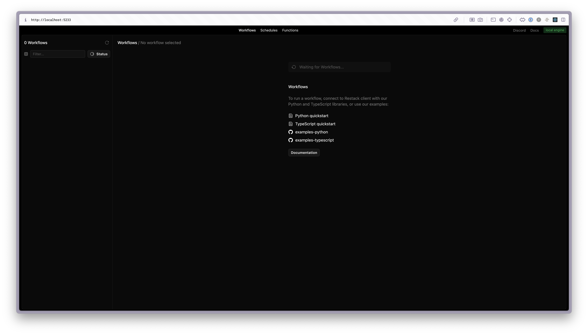
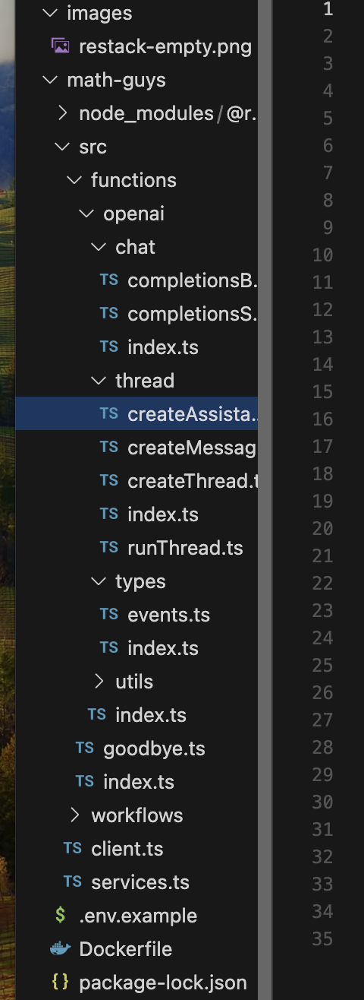
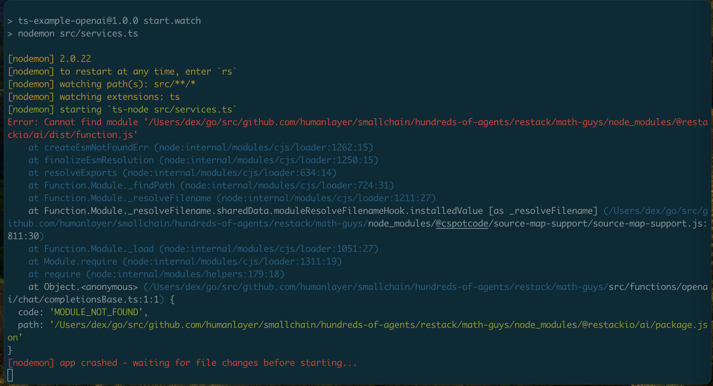

### Running

following guide in https://docs.restack.io/quickstart/typescript

start restack:

```
docker compose up -d
```

verify restack is running at http://localhost:5233/




### thoughts

- Good DevX 
    - I like docker to run things, 
    - `npx @restackio/get-started@latest` to get started is clean/easy
- holy fuck it code-gen'd like a million things is this what happens when you spend too long in temporal world?




- The onboarding CLI offered to install deps, but that step broke


```
Cloning into '/Users/dex/go/src/github.com/humanlayer/smallchain/hundreds-of-agents/restack/temp'...
remote: Enumerating objects: 3494, done.
remote: Counting objects: 100% (361/361), done.
remote: Compressing objects: 100% (229/229), done.
remote: Total 3494 (delta 195), reused 160 (delta 130), pack-reused 3133 (from 2)
Receiving objects: 100% (3494/3494), 3.65 MiB | 4.57 MiB/s, done.
Resolving deltas: 100% (1935/1935), done.
Moving files from /Users/dex/go/src/github.com/humanlayer/smallchain/hundreds-of-agents/restack/temp to /Users/dex/go/src/github.com/humanlayer/smallchain/hundreds-of-agents/restack/math-guys
Repository cloned successfully
npm warn tarball tarball data for @restackio/ai@https://registry.npmjs.org/@restackio/ai/-/ai-0.0.90.tgz (sha512-i4krGAb6mGRhk+5+H81uUK+mfu8DDBGtqb+HaSDq2uXDflrmbO+CrNbMfv5WMQKH6GMjM/RNw5CO7f6be48CsA==) seems to be corrupted. Trying again.
npm warn tarball tarball data for @restackio/ai@https://registry.npmjs.org/@restackio/ai/-/ai-0.0.90.tgz (sha512-i4krGAb6mGRhk+5+H81uUK+mfu8DDBGtqb+HaSDq2uXDflrmbO+CrNbMfv5WMQKH6GMjM/RNw5CO7f6be48CsA==) seems to be corrupted. Trying again.
npm warn tar TAR_ENTRY_ERROR ENOENT: no such file or directory, open '/Users/dex/go/src/github.com/humanlayer/smallchain/hundreds-of-agents/restack/math-guys/node_modules/@restackio/ai/dist/playground/workflow.d.ts'
npm warn cleanup Failed to remove some directories [
npm warn cleanup   [
npm warn cleanup     '/Users/dex/go/src/github.com/humanlayer/smallchain/hundreds-of-agents/restack/math-guys/node_modules/@restackio',
npm warn cleanup     [Error: ENOTEMPTY: directory not empty, rmdir '/Users/dex/go/src/github.com/humanlayer/smallchain/hundreds-of-agents/restack/math-guys/node_modules/@restackio/ai/dist'] {
npm warn cleanup       errno: -66,
npm warn cleanup       code: 'ENOTEMPTY',
npm warn cleanup       syscall: 'rmdir',
npm warn cleanup       path: '/Users/dex/go/src/github.com/humanlayer/smallchain/hundreds-of-agents/restack/math-guys/node_modules/@restackio/ai/dist'
npm warn cleanup     }
npm warn cleanup   ],
npm warn cleanup   [
npm warn cleanup     '/Users/dex/go/src/github.com/humanlayer/smallchain/hundreds-of-agents/restack/math-guys/node_modules',
npm warn cleanup     [Error: ENOTEMPTY: directory not empty, rmdir '/Users/dex/go/src/github.com/humanlayer/smallchain/hundreds-of-agents/restack/math-guys/node_modules/@restackio/ai/dist'] {
npm warn cleanup       errno: -66,
npm warn cleanup       code: 'ENOTEMPTY',
npm warn cleanup       syscall: 'rmdir',
npm warn cleanup       path: '/Users/dex/go/src/github.com/humanlayer/smallchain/hundreds-of-agents/restack/math-guys/node_modules/@restackio/ai/dist'
npm warn cleanup     }
npm warn cleanup   ]
npm warn cleanup ]
npm error code EINTEGRITY
npm error sha512-i4krGAb6mGRhk+5+H81uUK+mfu8DDBGtqb+HaSDq2uXDflrmbO+CrNbMfv5WMQKH6GMjM/RNw5CO7f6be48CsA== integrity checksum failed when using sha512: wanted sha512-i4krGAb6mGRhk+5+H81uUK+mfu8DDBGtqb+HaSDq2uXDflrmbO+CrNbMfv5WMQKH6GMjM/RNw5CO7f6be48CsA== but got sha512-eUhIChOdSRlzYjyjucQUg8oSAS1W7y53Wb2HJtOsv13ABMSfbtwqeSICrafGUT1z3ot8sQpFmw9JXEK/M+Sutg==. (9150 bytes)
npm error A complete log of this run can be found in: /Users/dex/.npm/_logs/2024-12-20T17_33_18_546Z-debug-0.log
2024/12/20 09:33:30 exit status 1
Error executing binary
```


- as the guide states, basics are in client and services, and everything else is the stuff you customize in functions / workflows. Workflows invoke "steps" from the functions dir

```typescript
  const openaiOutput = await step<typeof functions>({
    taskQueue: "openai",
  }).openaiChatCompletionsBase({
    userContent,
    jsonSchema,
  });
```

- guide asks me to run `npm build` `Unknown command: "build"`  but that doesn't work - let's try `npm run dev`



- lets try `rm -rf node_modules` and `npm install` again...works fine

same error


```

> ts-example-openai@1.0.0 start.watch
> nodemon src/services.ts

[nodemon] 2.0.22
[nodemon] to restart at any time, enter `rs`
[nodemon] watching path(s): src/**/*
[nodemon] watching extensions: ts
[nodemon] starting `ts-node src/services.ts`
Error: Cannot find module '/Users/dex/go/src/github.com/humanlayer/smallchain/hundreds-of-agents/restack/math-guys/node_modules/@restackio/ai/dist/function.js'
    at createEsmNotFoundErr (node:internal/modules/cjs/loader:1262:15)
    at finalizeEsmResolution (node:internal/modules/cjs/loader:1250:15)
    at resolveExports (node:internal/modules/cjs/loader:634:14)
    at Function.Module._findPath (node:internal/modules/cjs/loader:724:31)
    at Function.Module._resolveFilename (node:internal/modules/cjs/loader:1211:27)
    at Function.Module._resolveFilename.sharedData.moduleResolveFilenameHook.installedValue [as _resolveFilename] (/Users/dex/go/src/github.com/humanlayer/smallchain/hundreds-of-agents/restack/math-guys/node_modules/@cspotcode/source-map-support/source-map-support.js:811:30)
    at Function.Module._load (node:internal/modules/cjs/loader:1051:27)
    at Module.require (node:internal/modules/cjs/loader:1311:19)
    at require (node:internal/modules/helpers:179:18)
    at Object.<anonymous> (/Users/dex/go/src/github.com/humanlayer/smallchain/hundreds-of-agents/restack/math-guys/src/functions/openai/chat/completionsBase.ts:1:1) {
  code: 'MODULE_NOT_FOUND',
  path: '/Users/dex/go/src/github.com/humanlayer/smallchain/hundreds-of-agents/restack/math-guys/node_modules/@restackio/ai/package.json'
}
[nodemon] app crashed - waiting for file changes before starting...
```

### fuck this lets try the python one

- can it use uv instead of poetry yet?

- poetry shell, install, `run services` now its up and working:

```
[restack] 2024-12-20T09:46:33.708Z [DEBUG] Restack instance initialized
  options: None
[restack] 2024-12-20T09:46:33.909Z [INFO] Starting service...
[restack] 2024-12-20T09:46:33.964Z [INFO] Initializing worker {'namespace': 'default', 'task_queue': 'local-restack'}
[restack] 2024-12-20T09:46:34.165Z [INFO] Service created successfully
[restack] 2024-12-20T09:46:34.165Z [INFO] Creating playground service...
[restack] 2024-12-20T09:46:34.178Z [INFO] Services ready to receive workflows and events
[restack] 2024-12-20T09:46:34.178Z [INFO] Initializing worker {'task_queue': 'local-playground', 'namespace': 'default'}
[restack] 2024-12-20T09:46:34.178Z [INFO] Activity polling is disabled for this worker {}
```


OKay the python one worked...now let's try to do this math delegation example.

Looking...there's a stripe API example, I wonder if that uses the agent toolkit i'm familiar with.

THE GOOD NEWS - yes it does


THE BAD NEWS - they don't actually use restack for the agentic work, they delegate it to a langchain agent

https://github.com/restackio/examples-python/blob/main/stripe_ai/src/functions/create_payment_link.py


At this point my instinct is if the restack people can't use their own framework for agentic stuff, there's no way I'm going to be able to make it work... lets try though

...working through it

what in gods green earth is this with imports thing

```python
#workflow.py

with import_functions():
    from src.functions.function import welcome
    from src.functions.function import openai_prompt
```

continuing...the workflow I think I want is:

- prompt -> manager agent (workflow)
    - prompt -> openai_prompt (function)
    - for each delegation, workflow.child_start(...)
         - delegation tool call message becomes the prompt -> calculator_agent_prompt (function)
         - execute stadard ReAct tools loop
    - append delegation results to the messages from the manager agent

    
aside: Wow how thin can the temporal wrapper get?

