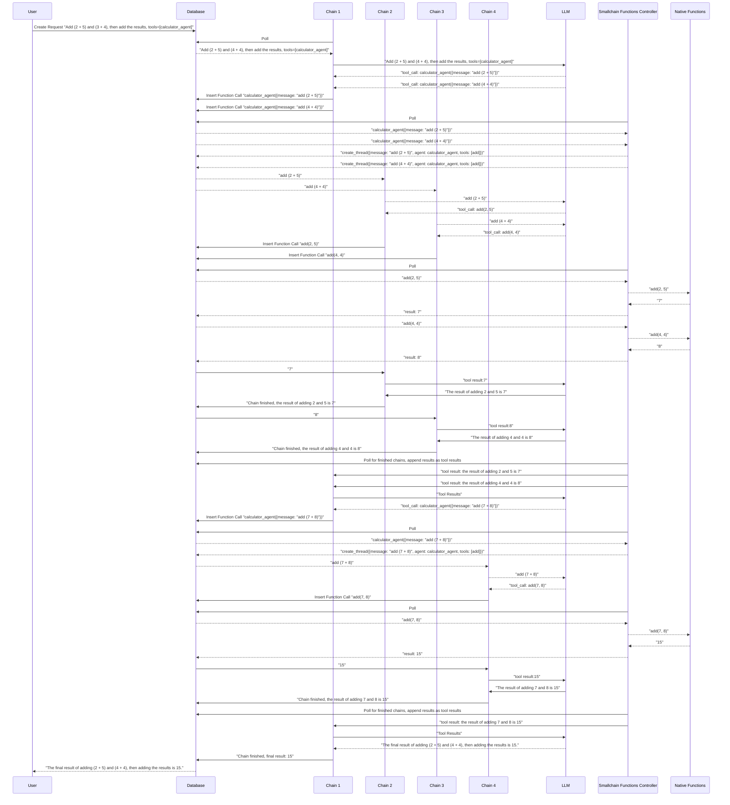

## Smallchain

```mermaid
sequenceDiagram
    participant U as User
    participant DB as Database
    U->>DB: Create Request "Add (2 + 5) and (3 + 4), then add the results, tools=[calculator_agent]"
    participant C as Chain 1
    participant C2 as Chain 2
    participant C3 as Chain 3
    participant C4 as Chain 4
    C->>DB: Poll
    DB-->>C: "Add (2 + 5) and (4 + 4), then add the results, tools=[calculator_agent]"
    participant LLM as LLM
    C->>LLM: "Add (2 + 5) and (4 + 4), then add the results, tools=[calculator_agent]"
    LLM-->>C: "tool_call: calculator_agent({message: "add (2 + 5)"})"
    LLM-->>C: "tool_call: calculator_agent({message: "add (4 + 4)"})"
    C->>DB: Insert Function Call "calculator_agent({message: "add (2 + 5)"})"
    C->>DB: Insert Function Call "calculator_agent({message: "add (4 + 4)"})"
    participant F as Smallchain Functions Controller
    F->>DB: Poll
    DB-->>F: "calculator_agent({message: "add (2 + 5)"})"
    DB-->>F: "calculator_agent({message: "add (4 + 4)"})"
    F-->>DB: "create_thread({message: "add (2 + 5)", agent: calculator_agent, tools: [add]})"
    F-->>DB: "create_thread({message: "add (4 + 4)", agent: calculator_agent, tools: [add]})"
    DB-->>C2: "add (2 + 5)"
    DB-->>C3: "add (4 + 4)"
    C2-->>LLM: "add (2 + 5)"
    LLM-->>C2: "tool_call: add(2, 5)"
    C3-->>LLM: "add (4 + 4)"
    LLM-->>C3: "tool_call: add(4, 4)"
    C2->>DB: Insert Function Call "add(2, 5)"
    C3->>DB: Insert Function Call "add(4, 4)"
    F->>DB: Poll
    participant NF as Native Functions
    DB-->>F: "add(2, 5)"
    F-->>NF: "add(2, 5)"
    NF-->>F: "7"
    F-->>DB: "result: 7"
    DB-->>F: "add(4, 4)"
    F-->>NF: "add(4, 4)"
    NF-->>F: "8"
    F-->>DB: "result: 8"
    DB->>C2: "7"
    C2->>LLM: "tool result:7"
    LLM->>C2: "The result of adding 2 and 5 is 7"
    C2->>DB: "Chain finished, the result of adding 2 and 5 is 7"
    DB->>C3: "8"
    C3->>LLM: "tool result:8"
    LLM->>C3: "The result of adding 4 and 4 is 8"
    C3->>DB: "Chain finished, the result of adding 4 and 4 is 8"
    F->>DB: Poll for finished chains, append results as tool results
    F->>C: "tool result: the result of adding 2 and 5 is 7"
    F->>C: "tool result: the result of adding 4 and 4 is 8"
    C->>LLM: "Tool Results"
    LLM-->>C: "tool_call: calculator_agent({message: "add (7 + 8)"})"
    C->>DB: Insert Function Call "calculator_agent({message: "add (7 + 8)"})"
    F->>DB: Poll
    DB-->>F: "calculator_agent({message: "add (7 + 8)"})"
    F-->>DB: "create_thread({message: "add (7 + 8)", agent: calculator_agent, tools: [add]})"
    DB-->>C4: "add (7 + 8)"
    C4-->>LLM: "add (7 + 8)"
    LLM-->>C4: "tool_call: add(7, 8)"
    C4->>DB: Insert Function Call "add(7, 8)"
    F->>DB: Poll
    DB-->>F: "add(7, 8)"
    F-->>NF: "add(7, 8)"
    NF-->>F: "15"
    F-->>DB: "result: 15"
    DB->>C4: "15"
    C4->>LLM: "tool result:15"
    LLM->>C4: "The result of adding 7 and 8 is 15"
    C4->>DB: "Chain finished, the result of adding 7 and 8 is 15"
    F->>DB: Poll for finished chains, append results as tool results
    F->>C: "tool result: the result of adding 7 and 8 is 15"
    C->>LLM: "Tool Results"
    LLM-->>C: "The final result of adding (2 + 5) and (4 + 4), then adding the results is 15."
    C->>DB: "Chain finished, final result: 15"
    DB-->>U: "The final result of adding (2 + 5) and (4 + 4), then adding the results is 15."
```
